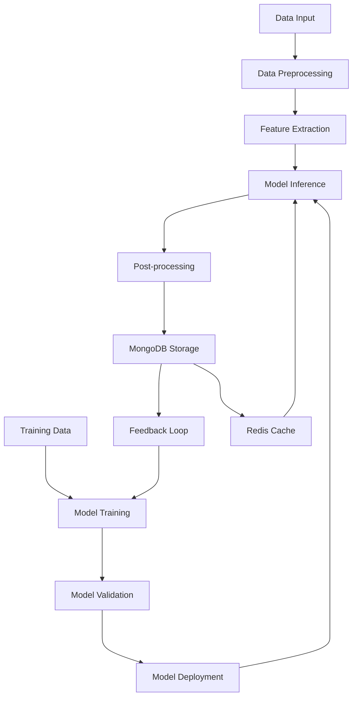

# AI/ML Integration - Stamp Collection System

## 🧠 AI/ML Architecture Overview

### Core AI Services for Electron Desktop App
- **Computer Vision**: Local and cloud-based image analysis and feature extraction
- **Natural Language Processing**: Text generation and market research with offline capability
- **Predictive Analytics**: Price forecasting and demand prediction using eBay/Wix data
- **Classification & Clustering**: Automated categorization and similarity matching
- **Desktop Integration**: Optimized for Electron with background processing
- **API Integration**: Real-time market data from eBay Finding API and Wix Studio API

### ML Pipeline Architecture


## 🖼️ Computer Vision Models

### Stamp Image Analysis Pipeline

#### 1. Image Preprocessing
```python
# Image preprocessing pipeline
def preprocess_stamp_image(image_path):
    """
    Preprocess stamp images for AI analysis
    """
    image = cv2.imread(image_path)
    
    # Resize to standard dimensions
    image = cv2.resize(image, (512, 512))
    
    # Enhance image quality
    image = cv2.bilateralFilter(image, 9, 75, 75)
    
    # Normalize pixel values
    image = image.astype(np.float32) / 255.0
    
    return image
```

#### 2. Feature Detection Models

##### Perforation Detection
```python
class PerforationDetector:
    """
    Detect stamp perforations using computer vision
    """
    def __init__(self):
        self.model = self.load_perforation_model()
    
    def detect_perforations(self, image):
        # Edge detection for perforation analysis
        edges = cv2.Canny(image, 50, 150)
        
        # Pattern recognition for perforation types
        perforation_type = self.classify_perforation_pattern(edges)
        
        return {
            'has_perforations': True/False,
            'perforation_type': 'roulette'/'line'/'comb',
            'gauge': 'measurement',
            'confidence': 0.95
        }
    
    def store_results(self, results):
        """Stores the perforation analysis results in MongoDB"""
        db.stamps.update_one(
            {'stamp_uuid': self.stamp_uuid},
            {'$set': {'perforation_analysis': results}}
        )
        redis.setex(f"perforation:{self.stamp_uuid}", 3600, json.dumps(results))

##### Watermark Detection
```python
class WatermarkDetector:
    """
    Detect watermarks in stamp images using advanced CV techniques
    """
    def __init__(self):
        self.model = self.load_watermark_model()
    
    def detect_watermark(self, image):
        # Apply frequency domain analysis
        fourier = np.fft.fft2(image)
        
        # Detect watermark patterns
        watermark_features = self.extract_watermark_features(fourier)
        
        return {
            'has_watermark': True/False,
            'watermark_type': 'crown'/'star'/'letters',
            'position': 'coordinates',
            'confidence': 0.88
        }
```

##### Color Analysis
```python
class ColorAnalyzer:
    """
    Analyze stamp colors and detect variations
    """
    def analyze_colors(self, image):
        # Extract dominant colors
        dominant_colors = self.extract_dominant_colors(image)
        
        # Color classification
        color_categories = self.classify_colors(dominant_colors)
        
        # Color condition assessment
        color_quality = self.assess_color_condition(image)
        
        return {
            'dominant_colors': ['red', 'blue', 'yellow'],
            'color_categories': ['primary', 'secondary'],
            'color_quality': 'excellent'/'good'/'fair'/'poor',
            'fading_detected': True/False,
            'confidence': 0.92
        }
```

#### 3. Condition Assessment Model

```python
class ConditionAssessment:
    """
    Assess stamp condition using computer vision
    """
    def __init__(self):
        self.condition_model = self.load_condition_model()
    
    def assess_condition(self, image):
        # Damage detection
        damages = self.detect_damages(image)
        
        # Overall condition scoring
        condition_score = self.calculate_condition_score(damages)
        
        return {
            'overall_condition': 'mint'/'used'/'damaged',
            'condition_score': 8.5,  # out of 10
            'damages': {
                'tears': [],
                'stains': [],
                'creases': [],
                'missing_parts': []
            },
            'gum_condition': 'original'/'partial'/'none',
            'centering': 'perfect'/'off-center',
            'confidence': 0.89
        }
```

### Pre-trained Model Integration

#### Using ResNet for Feature Extraction
```python
import torchvision.models as models
import torch.nn as nn

class StampFeatureExtractor:
    """
    Feature extraction using pre-trained ResNet
    """
    def __init__(self):
        # Load pre-trained ResNet50
        self.backbone = models.resnet50(pretrained=True)
        
        # Replace final layer for stamp-specific features
        self.backbone.fc = nn.Linear(2048, 512)
        
        # Fine-tune on stamp dataset
        self.fine_tune_model()
    
    def extract_features(self, image):
        with torch.no_grad():
            features = self.backbone(image)
        return features.numpy()
```

## 📝 Natural Language Processing

### Description Generation Pipeline

#### 1. Template-Based Generation
```python
class DescriptionGenerator:
    """
    Generate stamp descriptions using NLP
    """
    def __init__(self):
        self.nlp_model = self.load_nlp_model()
        self.templates = self.load_description_templates()
    
    def generate_description(self, stamp_data):
        # Extract key features
        features = self.extract_features(stamp_data)
        
        # Select appropriate template
        template = self.select_template(features)
        
        # Generate description
        description = self.fill_template(template, features)
        
        return {
            'title': 'Generated title',
            'description': 'Detailed description',
            'marketing_copy': 'Sales-focused text',
            'technical_details': 'Specifications'
        }
```

#### 2. GPT-based Content Generation
```python
from transformers import GPT2LMHeadModel, GPT2Tokenizer

class GPTDescriptionGenerator:
    """
    Use GPT for creative description generation
    """
    def __init__(self):
        self.tokenizer = GPT2Tokenizer.from_pretrained('gpt2')
        self.model = GPT2LMHeadModel.from_pretrained('gpt2')
    
    def generate_creative_description(self, stamp_features):
        # Create prompt
        prompt = self.create_prompt(stamp_features)
        
        # Generate text
        inputs = self.tokenizer.encode(prompt, return_tensors='pt')
        outputs = self.model.generate(inputs, max_length=200)
        
        description = self.tokenizer.decode(outputs[0])
        
        return self.post_process_description(description)
```

### Market Research & Analysis

#### 1. eBay and Wix API Integration for Market Data
```python
class MarketResearcher:
    """
    Research stamp market data using eBay and Wix APIs
    """
    def __init__(self):
        self.ebay_finding_api = EbayFindingAPI()
        self.ebay_trading_api = EbayTradingAPI()
        self.wix_api = WixStudioAPI()
        self.mongo_db = MongoClient()['stamp_collection']
        self.redis_client = redis.Redis()
    
    async def research_stamp(self, stamp_data):
        stamp_uuid = stamp_data['stamp_uuid']
        
        # Check Redis cache first
        cached_research = self.redis_client.get(f"market_research:{stamp_uuid}")
        if cached_research:
            return json.loads(cached_research)
        
        # eBay Finding API research
        ebay_data = await self.research_ebay_market(stamp_data)
        
        # Wix Studio API research
        wix_data = await self.research_wix_market(stamp_data)
        
        # Combine and analyze data
        market_analysis = self.analyze_combined_market_data(ebay_data, wix_data)
        
        # Store in MongoDB
        research_result = {
            'stamp_uuid': stamp_uuid,
            'ebay_analysis': ebay_data,
            'wix_analysis': wix_data,
            'market_analysis': market_analysis,
            'created_at': datetime.utcnow(),
            'expires_at': datetime.utcnow() + timedelta(hours=1)
        }
        
        self.mongo_db.market_research.insert_one(research_result)
        
        # Cache for 1 hour
        self.redis_client.setex(
            f"market_research:{stamp_uuid}", 
            3600, 
            json.dumps(research_result, default=str)
        )
        
        return research_result
    
    async def research_ebay_market(self, stamp_data):
        """Use eBay Finding API to research similar stamps"""
        search_params = {
            'keywords': f"{stamp_data['country']} {stamp_data['year']} {stamp_data['denomination']} stamp",
            'categoryId': '260324',  # Stamps > United States > 1941-Now: Unused
            'itemFilter': [
                {'name': 'Condition', 'value': stamp_data['condition']},
                {'name': 'ListingType', 'value': ['FixedPrice', 'Auction']}
            ],
            'sortOrder': 'PricePlusShipping'
        }
        
        similar_items = await self.ebay_finding_api.findItemsByKeywords(search_params)
        
        return {
            'similar_items': similar_items,
            'price_analysis': self.analyze_ebay_prices(similar_items),
            'market_metrics': self.calculate_ebay_metrics(similar_items)
        }
    
    async def research_wix_market(self, stamp_data):
        """Use Wix Studio API to research stamp collections"""
        collections = await self.wix_api.searchCollections({
            'query': f"stamps {stamp_data['country']} {stamp_data['year']}",
            'filters': {
                'category': 'collectibles',
                'subcategory': 'stamps'
            }
        })
        
        return {
            'similar_collections': collections,
            'design_insights': self.analyze_wix_designs(collections),
            'pricing_patterns': self.analyze_wix_pricing(collections)
        }
```

#### 2. Sentiment Analysis for Market Research
```python
from textblob import TextBlob

class MarketSentimentAnalyzer:
    """
    Analyze market sentiment from various sources
    """
    def analyze_market_sentiment(self, stamp_category):
        # Collect market discussions
        discussions = self.collect_market_discussions(stamp_category)
        
        # Analyze sentiment
        sentiments = []
        for discussion in discussions:
            blob = TextBlob(discussion)
            sentiments.append(blob.sentiment.polarity)
        
        avg_sentiment = sum(sentiments) / len(sentiments)
        
        return {
            'sentiment_score': avg_sentiment,
            'market_outlook': self.interpret_sentiment(avg_sentiment),
            'discussion_volume': len(discussions)
        }
```

## 📊 Predictive Analytics

### Price Prediction Models

#### 1. Machine Learning Model for Price Prediction
```python
from sklearn.ensemble import RandomForestRegressor
import numpy as np
import joblib
from pymongo import MongoClient

class PricePredictionModel:
    """
    Predict stamp prices using machine learning
    """
    def __init__(self):
        # Load pre-trained models
        self.rf_model = joblib.load('models/rf_model.pkl')
        self.features = ['year_issued', 'rarity_score', 'condition_score', 'market_trend']
        self.mongo_db = MongoClient()['stamp_collection']
    
    def predict_price(self, stamp_features):
        # Get predictions
        rf_pred = self.rf_model.predict([stamp_features[self.features]])[0]
        
        # Store prediction result
        prediction_result = {
            'stamp_uuid': stamp_features['stamp_uuid'],
            'predicted_price': rf_pred,
            'currency': 'USD',
            'prediction_date': datetime.utcnow()
        }
        self.mongo_db.price_predictions.insert_one(prediction_result)
        
        return {
            'estimated_price': rf_pred,
            'confidence_level': self.compute_confidence(rf_pred, stamp_features),
            'price_factors': self.explain_rf_prediction(stamp_features)
        }
```

#### 2. Time Series Forecasting
```python
from statsmodels.tsa.arima.model import ARIMA

class DemandForecaster:
    """
    Forecast demand for stamp categories
    """
    def __init__(self):
        self.models = {}
    
    def forecast_demand(self, category, historical_data):
        # Prepare time series data
        ts_data = self.prepare_time_series(historical_data)
        
        # Fit ARIMA model
        model = ARIMA(ts_data, order=(1,1,1))
        fitted_model = model.fit()
        
        # Generate forecast
        forecast = fitted_model.forecast(steps=30)  # 30 days ahead
        
        return {
            'forecast_values': forecast.tolist(),
            'confidence_intervals': self.get_confidence_intervals(fitted_model),
            'trend_direction': self.determine_trend(forecast)
        }
```

### Classification Models

#### 1. Stamp Categorization
```python
from sklearn.svm import SVC
from sklearn.feature_extraction.text import TfidfVectorizer

class StampClassifier:
    """
    Automatically classify stamps into categories
    """
    def __init__(self):
        self.text_vectorizer = TfidfVectorizer()
        self.image_classifier = self.load_image_classifier()
        self.text_classifier = SVC()
    
    def classify_stamp(self, stamp_data):
        # Text-based classification
        text_features = self.extract_text_features(stamp_data)
        text_category = self.text_classifier.predict([text_features])
        
        # Image-based classification
        image_features = self.extract_image_features(stamp_data['image'])
        image_category = self.image_classifier.predict([image_features])
        
        # Combine predictions
        final_category = self.combine_predictions(text_category, image_category)
        
        return {
            'primary_category': final_category,
            'subcategories': self.get_subcategories(final_category),
            'confidence': self.calculate_confidence(text_category, image_category)
        }
```

## 🔄 Model Training & Deployment

### Training Pipeline
```python
class MLPipeline:
    """
    Complete ML pipeline for stamp analysis
    """
    def __init__(self):
        self.models = {
            'computer_vision': ComputerVisionModel(),
            'nlp': NLPModel(),
            'price_prediction': PricePredictionModel(),
            'classification': ClassificationModel()
        }
    
    def train_all_models(self, training_data):
        # Split data by model type
        cv_data = training_data['images']
        nlp_data = training_data['descriptions']
        price_data = training_data['sales']
        
        # Train models
        for model_name, model in self.models.items():
            print(f"Training {model_name} model...")
            model.train(training_data[model_name])
            
        # Validate models
        self.validate_models()
    
    def validate_models(self):
        # Cross-validation for each model
        validation_results = {}
        for model_name, model in self.models.items():
            validation_results[model_name] = model.cross_validate()
        
        return validation_results
```

### Model Deployment
```python
import mlflow
import pickle

class ModelDeployment:
    """
    Deploy ML models for production use
    """
    def __init__(self):
        self.model_registry = {}
    
    def deploy_model(self, model, model_name, version):
        # Save model
        model_path = f"models/{model_name}_v{version}.pkl"
        with open(model_path, 'wb') as f:
            pickle.dump(model, f)
        
        # Log with MLflow
        mlflow.log_artifact(model_path)
        
        # Update registry
        self.model_registry[model_name] = {
            'version': version,
            'path': model_path,
            'deployed_at': datetime.now()
        }
    
    def load_model(self, model_name):
        model_info = self.model_registry[model_name]
        with open(model_info['path'], 'rb') as f:
            return pickle.load(f)
```

## 🎯 AI Service Integration

### Unified AI Service
```python
class StampAIService:
    """
    Unified service for all AI operations
    """
    def __init__(self):
        self.cv_service = ComputerVisionService()
        self.nlp_service = NLPService()
        self.prediction_service = PredictionService()
    
    def analyze_stamp(self, stamp_data):
        # Computer vision analysis
        cv_results = self.cv_service.analyze_image(stamp_data['image'])
        
        # NLP processing
        nlp_results = self.nlp_service.process_text(stamp_data['description'])
        
        # Price prediction
        price_prediction = self.prediction_service.predict_price(stamp_data)
        
        # Combine results
        return {
            'computer_vision': cv_results,
            'nlp_analysis': nlp_results,
            'price_prediction': price_prediction,
            'overall_confidence': self.calculate_overall_confidence([
                cv_results['confidence'],
                nlp_results['confidence'],
                price_prediction['confidence']
            ])
        }
```

### API Integration
```python
from flask import Flask, request, jsonify

app = Flask(__name__)
ai_service = StampAIService()

@app.route('/api/analyze-stamp', methods=['POST'])
def analyze_stamp():
    """
    API endpoint for stamp analysis
    """
    try:
        stamp_data = request.json
        results = ai_service.analyze_stamp(stamp_data)
        
        return jsonify({
            'success': True,
            'results': results
        })
    
    except Exception as e:
        return jsonify({
            'success': False,
            'error': str(e)
        }), 500
```

## 📈 Performance Optimization

### Model Optimization Techniques
- **Model Quantization**: Reduce model size for faster inference
- **Knowledge Distillation**: Create smaller, faster models
- **Batch Processing**: Process multiple stamps simultaneously
- **Caching**: Cache frequently requested analyses

### Infrastructure Considerations
- **GPU Acceleration**: Use CUDA for computer vision models
- **Distributed Processing**: Scale across multiple servers
- **Model Versioning**: Track and manage model versions
- **A/B Testing**: Compare model performance

## 🔗 Integration with Database

### AI Results Storage
```sql
-- Store AI analysis results
INSERT INTO ai_analysis (
    stamp_id, 
    analysis_type, 
    confidence_score, 
    results
) VALUES (
    $1, 
    'computer_vision', 
    $2, 
    $3::jsonb
);
```

### Feedback Loop Implementation
```python
class FeedbackProcessor:
    """
    Process user feedback to improve models
    """
    def process_feedback(self, stamp_id, feedback_data):
        # Store feedback
        self.store_feedback(stamp_id, feedback_data)
        
        # Update training data
        self.update_training_data(feedback_data)
        
        # Trigger model retraining if threshold met
        if self.should_retrain():
            self.trigger_retraining()
```

---

**Related Documents:**
- [[01-Database-Architecture]]
- [[03-Ecommerce-Integrations]]
- [[05-API-Documentation]]

**Last Updated**: 2025-07-01
**Version**: 1.0
