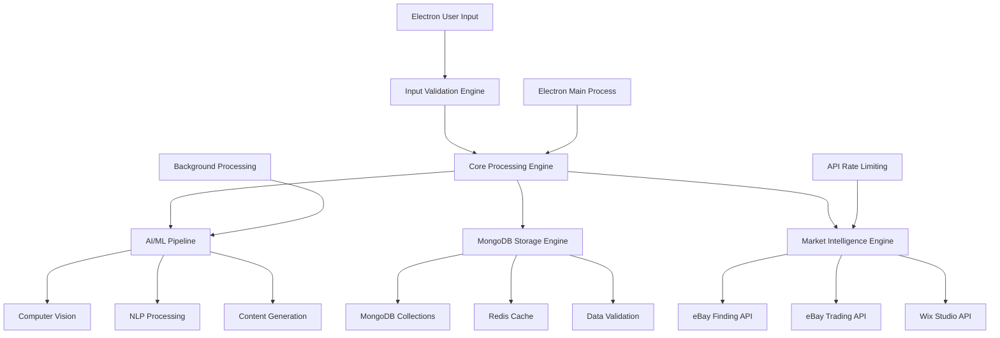

# Core Engine Architecture - Stamp Collection AI/ML Database

## 🎯 Engine Overview

The core engine is crafted for the Electron desktop environment, leveraging MongoDB and Redis to process minimal user input (Photos, Name, Auction Yes/No, Price) into a rich, AI-enhanced stamp database with real-time market intelligence and automated content generation.

### Core Philosophy
- **Minimal Input, Maximum Intelligence**: Users provide only 4 essential fields
- **AI-First Approach**: Machine learning drives data enrichment and market analysis
- **Real-Time Processing**: Sub-second response times for all operations
- **Continuous Learning**: Models adapt and improve through eBay and Wix API feedback
- **Offline Capability**: Full functionality available offline with data sync upon reconnect
- **Security and Compliance**: Encryption and secure storage throughout

## 🏗️ Engine Architecture



## 🔧 Core Engine Components

### 1. Input Processing Engine

#### Simplified Input Schema
```python
class StampInput:
    """
    Minimal user input structure for maximum simplicity
    """
    def __init__(self):
        self.required_fields = {
            'photos': [],      # Array of image files/URLs
            'name': '',        # Free text stamp identifier
            'auction': False,  # Boolean: auction vs fixed price
            'price': 0.00     # Decimal: starting bid or fixed price
        }
        
    def validate_input(self, user_data):
        """
        Validate and sanitize minimal user input
        """
        validation_result = {
            'valid': True,
            'errors': [],
            'sanitized_data': {}
        }
        
        # Photo validation
        if not user_data.get('photos') or len(user_data['photos']) == 0:
            validation_result['errors'].append('At least one photo is required')
            validation_result['valid'] = False
        
        # Name validation
        name = self.sanitize_text(user_data.get('name', ''))
        if len(name.strip()) < 3:
            validation_result['errors'].append('Name must be at least 3 characters')
            validation_result['valid'] = False
            
        # Price validation
        try:
            price = float(user_data.get('price', 0))
            if price <= 0:
                validation_result['errors'].append('Price must be greater than 0')
                validation_result['valid'] = False
        except ValueError:
            validation_result['errors'].append('Invalid price format')
            validation_result['valid'] = False
            
        # Auction validation
        auction = bool(user_data.get('auction', False))
        
        if validation_result['valid']:
            validation_result['sanitized_data'] = {
                'photos': self.process_photos(user_data['photos']),
                'name': name,
                'auction': auction,
                'price': price
            }
            
        return validation_result
```

#### Photo Processing Pipeline
```python
class PhotoProcessor:
    """
    Advanced photo processing for stamp images
    """
    def __init__(self):
        self.cloud_storage = CloudStorageManager()
        self.image_validator = ImageValidator()
        
    def process_photos(self, photo_inputs):
        """
        Process and store photos with metadata extraction
        """
        processed_photos = []
        
        for photo in photo_inputs:
            # Validate image
            if not self.image_validator.is_valid_image(photo):
                continue
                
            # Generate UUID for image
            image_uuid = uuid.uuid4()
            
            # Extract metadata
            metadata = self.extract_image_metadata(photo)
            
            # Optimize image (multiple resolutions)
            optimized_images = self.optimize_image(photo)
            
            # Upload to cloud storage
            storage_urls = self.cloud_storage.upload_image_set(
                image_uuid, 
                optimized_images
            )
            
            processed_photos.append({
                'image_uuid': str(image_uuid),
                'original_filename': photo.filename,
                'storage_urls': storage_urls,
                'metadata': metadata,
                'processed_at': datetime.utcnow()
            })
            
        return processed_photos
    
    def extract_image_metadata(self, image):
        """
        Extract comprehensive image metadata
        """
        metadata = {
            'dimensions': self.get_image_dimensions(image),
            'file_size': self.get_file_size(image),
            'format': self.get_image_format(image),
            'color_profile': self.analyze_color_profile(image),
            'quality_score': self.assess_image_quality(image),
            'technical_features': {
                'dpi': self.get_dpi(image),
                'color_depth': self.get_color_depth(image),
                'compression': self.get_compression_info(image)
            }
        }
        return metadata
```

### 2. UUID Management Engine

#### Global UUID Strategy
```python
class UUIDManager:
    """
    Centralized UUID management for global uniqueness
    """
    def __init__(self):
        self.uuid_registry = {}
        self.uuid_patterns = {
            'stamp': 'STP-',
            'user': 'USR-',
            'auction': 'AUC-',
            'transaction': 'TXN-',
            'image': 'IMG-',
            'ai_analysis': 'AIA-',
            'market_data': 'MKT-'
        }
    
    def generate_uuid(self, entity_type):
        """
        Generate typed UUID with prefix for easy identification
        """
        base_uuid = uuid.uuid4()
        prefix = self.uuid_patterns.get(entity_type, 'GEN-')
        typed_uuid = f"{prefix}{base_uuid}"
        
        # Register in global registry
        self.register_uuid(typed_uuid, entity_type)
        
        return typed_uuid
    
    def register_uuid(self, uuid_value, entity_type):
        """
        Register UUID in global registry for tracking
        """
        self.uuid_registry[uuid_value] = {
            'entity_type': entity_type,
            'created_at': datetime.utcnow(),
            'status': 'active'
        }
    
    def validate_uuid(self, uuid_value):
        """
        Validate UUID exists and is active
        """
        return uuid_value in self.uuid_registry and \
               self.uuid_registry[uuid_value]['status'] == 'active'
```

### 3. Core Data Processing Engine

#### Main Processing Pipeline
```python
class CoreProcessingEngine:
    """
    Main orchestrator for stamp data processing
    """
    def __init__(self):
        self.uuid_manager = UUIDManager()
        self.ai_pipeline = AIProcessingPipeline()
        self.market_engine = MarketIntelligenceEngine()
        self.storage_engine = DataStorageEngine()
        
    def process_stamp_input(self, validated_input):
        """
        Main processing pipeline for stamp input
        """
        processing_id = self.uuid_manager.generate_uuid('processing')
        
        try:
            # Step 1: Create core stamp record
            stamp_uuid = self.create_core_stamp_record(validated_input)
            
            # Step 2: Trigger AI processing (async)
            ai_task_id = self.ai_pipeline.start_processing(stamp_uuid, validated_input)
            
            # Step 3: Initiate market research (async)
            market_task_id = self.market_engine.start_research(stamp_uuid, validated_input)
            
            # Step 4: Return immediate response
            return {
                'success': True,
                'stamp_uuid': stamp_uuid,
                'processing_id': processing_id,
                'ai_task_id': ai_task_id,
                'market_task_id': market_task_id,
                'estimated_completion': datetime.utcnow() + timedelta(seconds=30)
            }
            
        except Exception as e:
            return {
                'success': False,
                'error': str(e),
                'processing_id': processing_id
            }
    
    def create_core_stamp_record(self, validated_input):
        """
        Create initial stamp record with minimal data
        """
        stamp_uuid = self.uuid_manager.generate_uuid('stamp')
        
        stamp_record = {
            'stamp_uuid': stamp_uuid,
            'name': validated_input['name'],
            'auction_enabled': validated_input['auction'],
            'user_price': validated_input['price'],
            'photos': validated_input['photos'],
            'status': 'processing',
            'created_at': datetime.utcnow(),
            'processing_stage': 'initial',
            'ai_enrichment_status': 'pending',
            'market_research_status': 'pending'
        }
        
        # Store initial record
        self.storage_engine.create_stamp_record(stamp_record)
        
        return stamp_uuid
```

## 🧠 AI Processing Pipeline

### Intelligent Data Enrichment
```python
class AIProcessingPipeline:
    """
    Comprehensive AI pipeline for stamp data enrichment
    """
    def __init__(self):
        self.computer_vision = ComputerVisionEngine()
        self.nlp_processor = NLPProcessor()
        self.content_generator = ContentGenerator()
        self.task_queue = AsyncTaskQueue()
        
    def start_processing(self, stamp_uuid, input_data):
        """
        Start asynchronous AI processing pipeline
        """
        task_id = self.uuid_manager.generate_uuid('ai_task')
        
        # Queue AI processing tasks
        self.task_queue.add_task({
            'task_id': task_id,
            'stamp_uuid': stamp_uuid,
            'input_data': input_data,
            'pipeline_steps': [
                'image_analysis',
                'feature_extraction',
                'classification',
                'content_generation',
                'market_context'
            ]
        })
        
        return task_id
    
    async def process_stamp_ai(self, stamp_uuid, input_data):
        """
        Complete AI processing pipeline
        """
        results = {
            'stamp_uuid': stamp_uuid,
            'processing_timestamp': datetime.utcnow(),
            'ai_confidence': 0.0,
            'enriched_data': {}
        }
        
        try:
            # Step 1: Computer Vision Analysis
            cv_results = await self.computer_vision.analyze_images(
                input_data['photos']
            )
            results['enriched_data']['computer_vision'] = cv_results
            
            # Step 2: Feature Extraction
            features = await self.extract_comprehensive_features(
                cv_results, 
                input_data['name']
            )
            results['enriched_data']['features'] = features
            
            # Step 3: Classification and Tagging
            classification = await self.classify_stamp(features)
            results['enriched_data']['classification'] = classification
            
            # Step 4: Content Generation
            content = await self.content_generator.generate_content(
                features, 
                classification, 
                input_data
            )
            results['enriched_data']['generated_content'] = content
            
            # Step 5: Calculate overall confidence
            results['ai_confidence'] = self.calculate_confidence(
                cv_results, features, classification, content
            )
            
            # Store AI results
            await self.storage_engine.update_stamp_ai_data(stamp_uuid, results)
            
            # Update processing status
            await self.storage_engine.update_processing_status(
                stamp_uuid, 
                'ai_complete'
            )
            
        except Exception as e:
            await self.storage_engine.update_processing_status(
                stamp_uuid, 
                'ai_failed', 
                error=str(e)
            )
            
        return results
```

### Advanced Computer Vision Engine
```python
class ComputerVisionEngine:
    """
    Advanced computer vision for stamp analysis
    """
    def __init__(self):
        self.models = {
            'feature_detector': self.load_feature_detection_model(),
            'condition_assessor': self.load_condition_model(),
            'classification_model': self.load_classification_model(),
            'text_extractor': self.load_ocr_model()
        }
        
    async def analyze_images(self, photos):
        """
        Comprehensive image analysis pipeline
        """
        analysis_results = {
            'primary_features': {},
            'condition_assessment': {},
            'visual_classification': {},
            'text_extraction': {},
            'quality_metrics': {},
            'confidence_scores': {}
        }
        
        for photo in photos:
            # Load and preprocess image
            image = await self.load_and_preprocess(photo)
            
            # Feature detection
            features = await self.detect_stamp_features(image)
            analysis_results['primary_features'][photo['image_uuid']] = features
            
            # Condition assessment
            condition = await self.assess_condition(image)
            analysis_results['condition_assessment'][photo['image_uuid']] = condition
            
            # Visual classification
            classification = await self.classify_visually(image)
            analysis_results['visual_classification'][photo['image_uuid']] = classification
            
            # Text extraction (country, year, denomination)
            text_data = await self.extract_text(image)
            analysis_results['text_extraction'][photo['image_uuid']] = text_data
            
            # Quality metrics
            quality = await self.assess_image_quality(image)
            analysis_results['quality_metrics'][photo['image_uuid']] = quality
            
        # Aggregate results across all images
        aggregated = await self.aggregate_image_results(analysis_results)
        
        return aggregated
    
    async def detect_stamp_features(self, image):
        """
        Detect specific stamp features
        """
        features = {
            'perforations': await self.detect_perforations(image),
            'watermarks': await self.detect_watermarks(image),
            'cancellations': await self.detect_cancellations(image),
            'colors': await self.analyze_colors(image),
            'design_elements': await self.detect_design_elements(image),
            'printing_method': await self.classify_printing_method(image)
        }
        
        return features
```

## 📊 Market Intelligence Engine

### Real-Time Market Analysis
```python
class MarketIntelligenceEngine:
    """
    Real-time market intelligence and pricing engine
    """
    def __init__(self):
        self.data_sources = {
            'auction_sites': AuctionDataScraper(),
            'catalog_sites': CatalogDataScraper(),
            'social_media': SocialMediaAnalyzer(),
            'price_guides': PriceGuideAPI(),
            'market_trends': TrendAnalyzer()
        }
        self.pricing_models = PricingModelEnsemble()
        
    async def start_research(self, stamp_uuid, input_data):
        """
        Start comprehensive market research
        """
        research_id = self.uuid_manager.generate_uuid('research')
        
        # Queue research tasks
        research_tasks = [
            self.research_similar_stamps(stamp_uuid, input_data),
            self.analyze_market_trends(stamp_uuid, input_data),
            self.calculate_price_intelligence(stamp_uuid, input_data),
            self.assess_market_demand(stamp_uuid, input_data)
        ]
        
        # Execute research tasks concurrently
        results = await asyncio.gather(*research_tasks)
        
        # Aggregate and store results
        aggregated_research = self.aggregate_research_results(results)
        await self.storage_engine.store_market_research(stamp_uuid, aggregated_research)
        
        return research_id
    
    async def research_similar_stamps(self, stamp_uuid, input_data):
        """
        Find and analyze similar stamps in the market
        """
        similar_stamps = []
        
        # Search across multiple data sources
        for source_name, source in self.data_sources.items():
            try:
                results = await source.search_similar(
                    name=input_data['name'],
                    features=input_data.get('ai_features', {})
                )
                similar_stamps.extend(results)
            except Exception as e:
                logger.warning(f"Failed to search {source_name}: {e}")
        
        # Deduplicate and rank by similarity
        unique_stamps = self.deduplicate_stamps(similar_stamps)
        ranked_stamps = self.rank_by_similarity(unique_stamps, input_data)
        
        return {
            'similar_stamps': ranked_stamps[:20],  # Top 20 most similar
            'total_found': len(unique_stamps),
            'average_price': self.calculate_average_price(ranked_stamps),
            'price_range': self.calculate_price_range(ranked_stamps)
        }
    
    async def calculate_price_intelligence(self, stamp_uuid, input_data):
        """
        Advanced price intelligence and recommendations
        """
        price_data = {
            'user_price': input_data['price'],
            'market_analysis': {},
            'price_recommendations': {},
            'confidence_intervals': {}
        }
        
        # Get AI-extracted features
        ai_features = await self.storage_engine.get_ai_features(stamp_uuid)
        
        # Create feature vector for pricing model
        feature_vector = self.create_pricing_feature_vector(
            input_data, 
            ai_features
        )
        
        # Run ensemble pricing models
        model_predictions = await self.pricing_models.predict_price(feature_vector)
        
        # Market sentiment analysis
        sentiment = await self.analyze_market_sentiment(ai_features)
        
        # Generate price recommendations
        recommendations = self.generate_price_recommendations(
            input_data['price'],
            model_predictions,
            sentiment,
            input_data['auction']
        )
        
        price_data['market_analysis'] = model_predictions
        price_data['price_recommendations'] = recommendations
        price_data['market_sentiment'] = sentiment
        
        return price_data
```

## 🔄 Continuous Learning System

### Adaptive Model Training
```python
class ContinuousLearningEngine:
    """
    Continuous learning system for model improvement
    """
    def __init__(self):
        self.feedback_processor = FeedbackProcessor()
        self.model_trainer = ModelTrainer()
        self.performance_monitor = PerformanceMonitor()
        
    async def process_user_feedback(self, stamp_uuid, feedback_data):
        """
        Process user feedback to improve models
        """
        # Store feedback
        await self.feedback_processor.store_feedback(stamp_uuid, feedback_data)
        
        # Analyze feedback patterns
        patterns = await self.feedback_processor.analyze_patterns()
        
        # Check if retraining is needed
        if self.should_retrain_models(patterns):
            await self.trigger_model_retraining()
    
    async def monitor_model_performance(self):
        """
        Continuous monitoring of model performance
        """
        performance_metrics = {
            'computer_vision_accuracy': await self.measure_cv_accuracy(),
            'pricing_accuracy': await self.measure_pricing_accuracy(),
            'content_quality': await self.measure_content_quality(),
            'user_satisfaction': await self.measure_user_satisfaction()
        }
        
        # Alert if performance degrades
        for metric, value in performance_metrics.items():
            if value < self.get_threshold(metric):
                await self.alert_performance_degradation(metric, value)
        
        return performance_metrics
    
    def should_retrain_models(self, feedback_patterns):
        """
        Determine if models need retraining based on feedback
        """
        criteria = {
            'feedback_volume': feedback_patterns['total_feedback'] > 1000,
            'accuracy_drop': feedback_patterns['accuracy_trend'] < 0.85,
            'user_corrections': feedback_patterns['correction_rate'] > 0.20,
            'time_since_training': feedback_patterns['days_since_training'] > 30
        }
        
        return sum(criteria.values()) >= 2  # At least 2 criteria met
```

## 📈 Performance Optimization

### Engine Performance Metrics
```python
class PerformanceOptimizer:
    """
    Performance optimization for core engine
    """
    def __init__(self):
        self.metrics_collector = MetricsCollector()
        self.cache_manager = CacheManager()
        self.load_balancer = LoadBalancer()
        
    async def optimize_processing_pipeline(self):
        """
        Optimize the processing pipeline based on metrics
        """
        # Collect performance metrics
        metrics = await self.metrics_collector.get_current_metrics()
        
        # Identify bottlenecks
        bottlenecks = self.identify_bottlenecks(metrics)
        
        # Apply optimizations
        for bottleneck in bottlenecks:
            await self.apply_optimization(bottleneck)
    
    def identify_bottlenecks(self, metrics):
        """
        Identify performance bottlenecks
        """
        bottlenecks = []
        
        if metrics['image_processing_time'] > 2.0:  # > 2 seconds
            bottlenecks.append('image_processing')
            
        if metrics['ai_inference_time'] > 1.0:  # > 1 second
            bottlenecks.append('ai_inference')
            
        if metrics['database_query_time'] > 0.5:  # > 500ms
            bottlenecks.append('database_queries')
            
        return bottlenecks
    
    async def apply_optimization(self, bottleneck_type):
        """
        Apply specific optimizations for bottlenecks
        """
        optimizations = {
            'image_processing': self.optimize_image_processing,
            'ai_inference': self.optimize_ai_inference,
            'database_queries': self.optimize_database_queries
        }
        
        if bottleneck_type in optimizations:
            await optimizations[bottleneck_type]()
```

## 🎯 Success Metrics

### Key Performance Indicators
```python
class EngineMetrics:
    """
    Core engine success metrics
    """
    target_metrics = {
        'processing_speed': {
            'image_analysis': 1.0,      # < 1 second
            'ai_enrichment': 5.0,       # < 5 seconds
            'total_processing': 30.0    # < 30 seconds
        },
        'accuracy_targets': {
            'feature_detection': 0.95,  # > 95%
            'price_prediction': 0.90,   # > 90%
            'content_generation': 0.85  # > 85%
        },
        'user_satisfaction': {
            'completion_rate': 0.90,    # > 90%
            'accuracy_rating': 4.0,     # > 4.0/5.0
            'time_to_list': 300.0      # < 5 minutes
        },
        'scalability': {
            'concurrent_users': 10000,  # 10K users
            'daily_processing': 100000, # 100K stamps/day
            'response_time_p95': 2.0    # < 2 seconds
        }
    }
    
    async def measure_success(self):
        """
        Measure engine success against targets
        """
        current_metrics = await self.collect_current_metrics()
        success_scores = {}
        
        for category, targets in self.target_metrics.items():
            category_score = 0
            for metric, target in targets.items():
                current_value = current_metrics.get(f"{category}_{metric}", 0)
                if self.is_better_performance(metric, current_value, target):
                    category_score += 1
            
            success_scores[category] = category_score / len(targets)
        
        overall_success = sum(success_scores.values()) / len(success_scores)
        
        return {
            'overall_success': overall_success,
            'category_scores': success_scores,
            'target_achievement': overall_success >= 0.85  # 85% target
        }
```

---

**Related Documents:**
- [[04-Simplified-Input-Processing]]
- [[05-AI-Pipeline-Architecture]]
- [[06-Market-Intelligence-Engine]]
- [[07-UUID-Management-System]]

**Last Updated**: 2025-07-01
**Version**: 1.0
