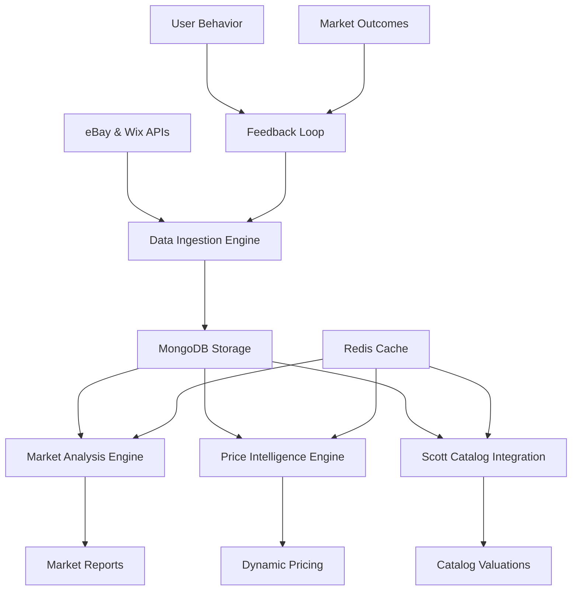

# Market Intelligence Engine

## 🎯 Overview

The Market Intelligence Engine is the core component responsible for real-time market analysis, adaptive pricing, eBay/Wix API integration, and trend analysis. It transforms the stamp database into a living, intelligent marketplace that continuously learns and adapts to market conditions.

This engine integrates with the Scott Catalog database to provide authoritative stamp identification, valuation references, and historical context for market analysis. It uses MongoDB for flexible data storage and Redis for high-performance caching.

## 🏗️ Engine Architecture



## 📊 Data Sources Integration

### Scott Catalog Database Integration

```python
class ScottCatalogIntegration:
    """
    Integration with Scott Catalog database for authoritative stamp data
    """
    def __init__(self):
        self.mongo_db = MongoClient()['stamp_collection']
        self.scott_db = {
            'countries': self.mongo_db.countries,
            'sets': self.mongo_db.sets,
            'stamps': self.mongo_db.stamps
        }
        self.redis_client = redis.Redis()
    
    def lookup_scott_number(self, stamp_data):
        """
        Find Scott catalog number for a stamp
        """
        country = stamp_data.get('country')
        year = stamp_data.get('year_issued')
        denomination = stamp_data.get('denomination')
        
        # Search Scott catalog
        scott_stamp = self.scott_db['stamps'].find_one({
            'countryId': self.get_country_id(country),
            'yearOfIssue': year,
            'denomination.value': denomination
        })
        
        if scott_stamp:
            return {
                'scott_number': scott_stamp['fullNumber'],
                'catalog_value': scott_stamp['catalogValues'],
                'listing_style': scott_stamp['listingStyle'],
                'description': scott_stamp['description']
            }
        return None

### API Data Collection Strategy

```python
class MarketDataCollector:
    """
    Collect market data from eBay and Wix APIs
    """
    def __init__(self):
        self.data_sources = {
            'ebay_finding': EbayFindingAPI(),
            'ebay_trading': EbayTradingAPI(),
            'wix_studio': WixStudioAPI(),
            'scott_catalog': ScottCatalogIntegration()
        }
        
        self.scraping_scheduler = ScrapingScheduler()
        self.data_validator = DataValidator()
        self.duplicate_detector = DuplicateDetector()
        
    async def execute_comprehensive_scraping(self) -> dict:
        """
        Execute comprehensive market data scraping across all sources
        """
        scraping_results = {
            'timestamp': datetime.utcnow(),
            'sources_scraped': 0,
            'total_records': 0,
            'data_by_source': {},
            'errors': [],
            'processing_time': 0
        }
        
        start_time = time.time()
        
        # Execute scraping tasks concurrently by category
        scraping_tasks = []
        for category, sources in self.data_sources.items():
            for source_name, scraper in sources.items():
                task = self.scrape_source_with_limits(
                    source_name, scraper, category
                )
                scraping_tasks.append(task)
        
        # Execute all scraping tasks
        results = await asyncio.gather(*scraping_tasks, return_exceptions=True)
        
        # Process results
        for i, result in enumerate(results):
            if isinstance(result, Exception):
                scraping_results['errors'].append({
                    'source': f'source_{i}',
                    'error': str(result)
                })
            else:
                source_name = result['source_name']
                scraping_results['data_by_source'][source_name] = result
                scraping_results['total_records'] += result['records_found']
                scraping_results['sources_scraped'] += 1
        
        scraping_results['processing_time'] = time.time() - start_time
        
        # Store aggregated results
        await self.store_market_data(scraping_results)
        
        return scraping_results
    
    async def scrape_source_with_limits(self, source_name: str, scraper, category: str) -> dict:
        """
        Scrape individual source with rate limiting and error handling
        """
        try:
            # Apply rate limiting
            await self.apply_rate_limiting(source_name)
            
            # Execute scraping
            raw_data = await scraper.scrape_data()
            
            # Validate and clean data
            validated_data = await self.data_validator.validate_source_data(
                raw_data, source_name, category
            )
            
            # Detect and remove duplicates
            unique_data = await self.duplicate_detector.remove_duplicates(
                validated_data, source_name
            )
            
            return {
                'source_name': source_name,
                'category': category,
                'records_found': len(unique_data),
                'data': unique_data,
                'scrape_timestamp': datetime.utcnow(),
                'data_quality_score': validated_data['quality_score']
            }
            
        except Exception as e:
            logger.error(f"Scraping failed for {source_name}: {e}")
            raise e
```

### Real-Time Data Processing

```python
class RealTimeDataProcessor:
    """
    Process market data in real-time as it arrives
    """
    def __init__(self):
        self.data_pipeline = DataPipeline()
        self.anomaly_detector = AnomalyDetector()
        self.trend_analyzer = TrendAnalyzer()
        self.alert_system = AlertSystem()
        
    async def process_incoming_data(self, data_batch: dict) -> dict:
        """
        Process incoming market data batch
        """
        processing_result = {
            'batch_id': data_batch['batch_id'],
            'records_processed': 0,
            'anomalies_detected': 0,
            'trends_identified': [],
            'alerts_generated': [],
            'processing_time': 0
        }
        
        start_time = time.time()
        
        try:
            # Stage 1: Data normalization
            normalized_data = await self.data_pipeline.normalize_data(data_batch['data'])
            
            # Stage 2: Anomaly detection
            anomalies = await self.anomaly_detector.detect_anomalies(normalized_data)
            processing_result['anomalies_detected'] = len(anomalies)
            
            # Stage 3: Trend analysis
            trends = await self.trend_analyzer.analyze_trends(normalized_data)
            processing_result['trends_identified'] = trends
            
            # Stage 4: Generate alerts for significant changes
            alerts = await self.generate_market_alerts(anomalies, trends)
            processing_result['alerts_generated'] = alerts
            
            # Stage 5: Update market intelligence database
            await self.update_market_intelligence(normalized_data, trends, anomalies)
            
            processing_result['records_processed'] = len(normalized_data)
            processing_result['processing_time'] = time.time() - start_time
            
        except Exception as e:
            processing_result['error'] = str(e)
            logger.error(f"Real-time processing failed: {e}")
        
        return processing_result
    
    async def generate_market_alerts(self, anomalies: list, trends: list) -> list:
        """
        Generate alerts for significant market events
        """
        alerts = []
        
        # Price spike alerts
        for anomaly in anomalies:
            if anomaly['type'] == 'price_spike' and anomaly['magnitude'] > 0.5:
                alerts.append({
                    'type': 'price_alert',
                    'severity': 'high',
                    'message': f"Significant price increase detected: {anomaly['description']}",
                    'affected_categories': anomaly['categories'],
                    'timestamp': datetime.utcnow()
                })
        
        # Trend alerts
        for trend in trends:
            if trend['strength'] > 0.8:  # Strong trend
                alerts.append({
                    'type': 'trend_alert',
                    'severity': 'medium',
                    'message': f"Strong market trend detected: {trend['description']}",
                    'trend_direction': trend['direction'],
                    'affected_categories': trend['categories'],
                    'timestamp': datetime.utcnow()
                })
        
        # Volume alerts
        volume_anomalies = [a for a in anomalies if a['type'] == 'volume_spike']
        if len(volume_anomalies) > 3:  # Multiple volume spikes
            alerts.append({
                'type': 'volume_alert',
                'severity': 'medium',
                'message': "Increased market activity detected across multiple categories",
                'timestamp': datetime.utcnow()
            })
        
        return alerts
```

## 🧠 Pricing Intelligence Engine

### Dynamic Pricing Models

```python
class PricingIntelligenceEngine:
    """
    Advanced pricing intelligence with ML-driven recommendations
    """
    def __init__(self):
        self.pricing_models = {
            'linear_regression': LinearPricingModel(),
            'random_forest': RandomForestPricingModel(),
            'neural_network': NeuralNetworkPricingModel(),
            'xgboost': XGBoostPricingModel()
        }
        
        self.feature_engineer = PricingFeatureEngineer()
        self.model_ensemble = ModelEnsemble()
        self.confidence_calculator = ConfidenceCalculator()
        
    async def generate_pricing_intelligence(self, stamp_data: dict) -> dict:
        """
        Generate comprehensive pricing intelligence for a stamp
        """
        # Extract and engineer features
        features = await self.feature_engineer.extract_pricing_features(stamp_data)
        
        # Get predictions from all models
        model_predictions = {}
        for model_name, model in self.pricing_models.items():
            try:
                prediction = await model.predict_price(features)
                model_predictions[model_name] = prediction
            except Exception as e:
                logger.warning(f"Model {model_name} prediction failed: {e}")
        
        # Ensemble prediction
        ensemble_prediction = await self.model_ensemble.combine_predictions(
            model_predictions, features
        )
        
        # Calculate confidence intervals
        confidence_intervals = await self.confidence_calculator.calculate_intervals(
            model_predictions, features
        )
        
        # Market context analysis
        market_context = await self.analyze_market_context(stamp_data, features)
        
        # Generate recommendations
        recommendations = await self.generate_pricing_recommendations(
            ensemble_prediction, confidence_intervals, market_context, stamp_data
        )
        
        return {
            'price_prediction': ensemble_prediction,
            'confidence_intervals': confidence_intervals,
            'model_predictions': model_predictions,
            'market_context': market_context,
            'recommendations': recommendations,
            'features_used': features,
            'prediction_timestamp': datetime.utcnow()
        }
    
    async def generate_pricing_recommendations(
        self, 
        prediction: dict, 
        confidence: dict, 
        market_context: dict, 
        stamp_data: dict
    ) -> dict:
        """
        Generate actionable pricing recommendations
        """
        user_price = stamp_data.get('user_price', 0)
        is_auction = stamp_data.get('auction_enabled', False)
        
        recommendations = {
            'optimal_pricing': {},
            'pricing_strategy': '',
            'market_timing': {},
            'risk_assessment': {},
            'competitive_analysis': {}
        }
        
        # Optimal pricing calculation
        predicted_price = prediction['predicted_value']
        confidence_level = confidence['confidence_score']
        
        if is_auction:
            # Auction pricing strategy
            recommendations['optimal_pricing'] = {
                'starting_bid': max(predicted_price * 0.7, 0.99),  # Start lower
                'reserve_price': predicted_price * 0.9,
                'buy_it_now': predicted_price * 1.2,
                'estimated_final': predicted_price
            }
            recommendations['pricing_strategy'] = 'auction_optimization'
        else:
            # Fixed price strategy
            market_premium = self.calculate_market_premium(market_context)
            recommendations['optimal_pricing'] = {
                'fixed_price': predicted_price * (1 + market_premium),
                'best_offer_minimum': predicted_price * 0.85,
                'bulk_discount': predicted_price * 0.95
            }
            recommendations['pricing_strategy'] = 'fixed_price_optimization'
        
        # Market timing analysis
        recommendations['market_timing'] = await self.analyze_optimal_timing(
            stamp_data, market_context
        )
        
        # Risk assessment
        recommendations['risk_assessment'] = {
            'price_volatility': market_context['volatility_score'],
            'demand_stability': market_context['demand_stability'],
            'competition_level': market_context['competition_intensity'],
            'recommendation': self.assess_pricing_risk(confidence_level, market_context)
        }
        
        return recommendations
    
    async def analyze_optimal_timing(self, stamp_data: dict, market_context: dict) -> dict:
        """
        Analyze optimal timing for listing
        """
        timing_analysis = {
            'current_market_score': 0.0,
            'optimal_listing_time': None,
            'seasonal_factors': {},
            'demand_forecast': {}
        }
        
        # Current market conditions
        current_score = (
            market_context['demand_level'] * 0.4 +
            market_context['competition_favorability'] * 0.3 +
            market_context['price_trend_favorability'] * 0.3
        )
        timing_analysis['current_market_score'] = current_score
        
        # Seasonal analysis
        category = stamp_data.get('category', 'general')
        seasonal_data = await self.get_seasonal_patterns(category)
        timing_analysis['seasonal_factors'] = seasonal_data
        
        # Demand forecasting
        demand_forecast = await self.forecast_demand(stamp_data, 30)  # 30 days
        timing_analysis['demand_forecast'] = demand_forecast
        
        # Recommendation
        if current_score > 0.8:
            timing_analysis['recommendation'] = 'list_immediately'
        elif current_score > 0.6:
            timing_analysis['recommendation'] = 'list_soon'
        else:
            optimal_time = await self.find_optimal_future_time(
                seasonal_data, demand_forecast
            )
            timing_analysis['optimal_listing_time'] = optimal_time
            timing_analysis['recommendation'] = 'wait_for_better_timing'
        
        return timing_analysis
```

### Adaptive Pricing System

```python
class AdaptivePricingSystem:
    """
    System that continuously adapts prices based on market feedback
    """
    def __init__(self):
        self.performance_tracker = PricingPerformanceTracker()
        self.adaptation_engine = PriceAdaptationEngine()
        self.market_monitor = MarketMonitor()
        
    async def monitor_and_adapt_prices(self) -> dict:
        """
        Continuously monitor market performance and adapt prices
        """
        adaptation_results = {
            'stamps_analyzed': 0,
            'prices_adjusted': 0,
            'performance_improvements': [],
            'market_changes_detected': [],
            'adaptation_timestamp': datetime.utcnow()
        }
        
        # Get all active listings
        active_listings = await self.get_active_listings()
        
        for listing in active_listings:
            try:
                # Analyze current performance
                performance = await self.performance_tracker.analyze_listing_performance(
                    listing['stamp_uuid']
                )
                
                # Check for market changes
                market_changes = await self.market_monitor.detect_changes_for_stamp(
                    listing['stamp_uuid']
                )
                
                # Determine if adaptation is needed
                if self.should_adapt_price(performance, market_changes):
                    # Calculate new optimal price
                    new_price = await self.adaptation_engine.calculate_adapted_price(
                        listing, performance, market_changes
                    )
                    
                    # Apply price adaptation
                    if new_price != listing['current_price']:
                        await self.apply_price_adaptation(
                            listing['stamp_uuid'], 
                            new_price, 
                            performance, 
                            market_changes
                        )
                        adaptation_results['prices_adjusted'] += 1
                
                adaptation_results['stamps_analyzed'] += 1
                
            except Exception as e:
                logger.error(f"Adaptation failed for {listing['stamp_uuid']}: {e}")
        
        return adaptation_results
    
    def should_adapt_price(self, performance: dict, market_changes: dict) -> bool:
        """
        Determine if price adaptation is needed
        """
        adaptation_triggers = [
            # Poor performance triggers
            performance['view_to_inquiry_ratio'] < 0.05,  # Low interest
            performance['days_since_last_view'] > 7,       # Stale listing
            performance['price_competitiveness'] < 0.3,    # Overpriced
            
            # Market change triggers
            market_changes['similar_items_price_drop'] > 0.1,  # 10% price drop
            market_changes['demand_increase'] > 0.2,           # 20% demand increase
            market_changes['supply_decrease'] > 0.15,          # 15% supply decrease
            
            # Seasonal triggers
            market_changes.get('seasonal_adjustment_recommended', False)
        ]
        
        # Adapt if any trigger is met
        return any(adaptation_triggers)
    
    async def apply_price_adaptation(
        self, 
        stamp_uuid: str, 
        new_price: float, 
        performance: dict, 
        market_changes: dict
    ):
        """
        Apply price adaptation and track results
        """
        # Update listing price
        await self.update_listing_price(stamp_uuid, new_price)
        
        # Log adaptation
        adaptation_log = {
            'stamp_uuid': stamp_uuid,
            'old_price': performance['current_price'],
            'new_price': new_price,
            'price_change_percent': (new_price - performance['current_price']) / performance['current_price'],
            'adaptation_reason': self.determine_adaptation_reason(performance, market_changes),
            'performance_metrics': performance,
            'market_context': market_changes,
            'timestamp': datetime.utcnow()
        }
        
        await self.log_price_adaptation(adaptation_log)
        
        # Schedule performance tracking
        await self.schedule_adaptation_tracking(stamp_uuid, adaptation_log)
```

## 📈 Trend Analysis Engine

### Market Trend Detection

```python
class TrendAnalysisEngine:
    """
    Detect and analyze market trends across multiple dimensions
    """
    def __init__(self):
        self.time_series_analyzer = TimeSeriesAnalyzer()
        self.pattern_detector = PatternDetector()
        self.trend_classifier = TrendClassifier()
        self.significance_tester = SignificanceTester()
        
    async def analyze_market_trends(self, time_window: int = 90) -> dict:
        """
        Comprehensive market trend analysis
        """
        trend_analysis = {
            'analysis_period': time_window,
            'price_trends': {},
            'volume_trends': {},
            'category_trends': {},
            'geographic_trends': {},
            'seasonal_patterns': {},
            'emerging_trends': [],
            'trend_predictions': {},
            'analysis_timestamp': datetime.utcnow()
        }
        
        # Get market data for analysis period
        market_data = await self.get_market_data(time_window)
        
        # Price trend analysis
        price_trends = await self.analyze_price_trends(market_data)
        trend_analysis['price_trends'] = price_trends
        
        # Volume trend analysis
        volume_trends = await self.analyze_volume_trends(market_data)
        trend_analysis['volume_trends'] = volume_trends
        
        # Category-specific trends
        category_trends = await self.analyze_category_trends(market_data)
        trend_analysis['category_trends'] = category_trends
        
        # Geographic trends
        geographic_trends = await self.analyze_geographic_trends(market_data)
        trend_analysis['geographic_trends'] = geographic_trends
        
        # Seasonal pattern detection
        seasonal_patterns = await self.detect_seasonal_patterns(market_data)
        trend_analysis['seasonal_patterns'] = seasonal_patterns
        
        # Emerging trend detection
        emerging_trends = await self.detect_emerging_trends(market_data)
        trend_analysis['emerging_trends'] = emerging_trends
        
        # Trend predictions
        predictions = await self.generate_trend_predictions(trend_analysis)
        trend_analysis['trend_predictions'] = predictions
        
        return trend_analysis
    
    async def analyze_price_trends(self, market_data: dict) -> dict:
        """
        Analyze price trends across different dimensions
        """
        price_trends = {
            'overall_market': {},
            'by_category': {},
            'by_country': {},
            'by_era': {},
            'by_condition': {}
        }
        
        # Overall market price trend
        overall_prices = market_data['price_time_series']
        price_trends['overall_market'] = await self.time_series_analyzer.analyze_trend(
            overall_prices, metric='price'
        )
        
        # Category-wise price trends
        for category, category_data in market_data['by_category'].items():
            if len(category_data) > 10:  # Minimum data points
                trend = await self.time_series_analyzer.analyze_trend(
                    category_data, metric='price'
                )
                price_trends['by_category'][category] = trend
        
        # Country-wise price trends
        for country, country_data in market_data['by_country'].items():
            if len(country_data) > 5:
                trend = await self.time_series_analyzer.analyze_trend(
                    country_data, metric='price'
                )
                price_trends['by_country'][country] = trend
        
        return price_trends
    
    async def detect_emerging_trends(self, market_data: dict) -> list:
        """
        Detect emerging trends that might become significant
        """
        emerging_trends = []
        
        # Recent data focus (last 30 days)
        recent_data = self.filter_recent_data(market_data, days=30)
        
        # Pattern detection for emerging trends
        patterns = await self.pattern_detector.detect_patterns(recent_data)
        
        for pattern in patterns:
            # Test for statistical significance
            significance = await self.significance_tester.test_significance(
                pattern, market_data
            )
            
            if significance['is_significant']:
                trend_classification = await self.trend_classifier.classify_trend(
                    pattern, significance
                )
                
                emerging_trend = {
                    'trend_id': self.generate_trend_id(),
                    'type': trend_classification['type'],
                    'description': trend_classification['description'],
                    'strength': significance['strength'],
                    'confidence': significance['confidence'],
                    'affected_categories': pattern['categories'],
                    'detected_date': datetime.utcnow(),
                    'prediction_horizon': trend_classification['horizon'],
                    'potential_impact': trend_classification['impact_score']
                }
                
                emerging_trends.append(emerging_trend)
        
        # Sort by potential impact
        emerging_trends.sort(key=lambda x: x['potential_impact'], reverse=True)
        
        return emerging_trends[:10]  # Top 10 emerging trends
```

## 🔄 Continuous Learning System

### Market Intelligence Feedback Loop

```python
class MarketIntelligenceLearningSystem:
    """
    Continuous learning system for market intelligence
    """
    def __init__(self):
        self.outcome_tracker = OutcomeTracker()
        self.model_updater = ModelUpdater()
        self.performance_analyzer = PerformanceAnalyzer()
        self.learning_scheduler = LearningScheduler()
        
    async def process_market_outcomes(self) -> dict:
        """
        Process market outcomes to improve intelligence
        """
        learning_results = {
            'outcomes_processed': 0,
            'models_updated': 0,
            'accuracy_improvements': {},
            'new_patterns_discovered': [],
            'learning_timestamp': datetime.utcnow()
        }
        
        # Get recent market outcomes
        outcomes = await self.outcome_tracker.get_recent_outcomes()
        
        for outcome in outcomes:
            try:
                # Analyze prediction accuracy
                accuracy_analysis = await self.analyze_prediction_accuracy(outcome)
                
                # Extract learning signals
                learning_signals = await self.extract_learning_signals(
                    outcome, accuracy_analysis
                )
                
                # Update relevant models
                if learning_signals['should_update_models']:
                    updated_models = await self.model_updater.update_models(
                        learning_signals
                    )
                    learning_results['models_updated'] += len(updated_models)
                
                # Discover new patterns
                new_patterns = await self.discover_patterns(outcome)
                learning_results['new_patterns_discovered'].extend(new_patterns)
                
                learning_results['outcomes_processed'] += 1
                
            except Exception as e:
                logger.error(f"Learning from outcome failed: {e}")
        
        # Update performance metrics
        await self.update_performance_metrics(learning_results)
        
        return learning_results
    
    async def analyze_prediction_accuracy(self, outcome: dict) -> dict:
        """
        Analyze how accurate our predictions were
        """
        prediction = outcome['original_prediction']
        actual_result = outcome['actual_result']
        
        accuracy_analysis = {
            'price_accuracy': 0.0,
            'timing_accuracy': 0.0,
            'trend_accuracy': 0.0,
            'overall_accuracy': 0.0,
            'error_magnitude': 0.0,
            'error_direction': '',
            'contributing_factors': []
        }
        
        # Price prediction accuracy
        if 'predicted_price' in prediction and 'final_price' in actual_result:
            predicted_price = prediction['predicted_price']
            actual_price = actual_result['final_price']
            
            price_error = abs(predicted_price - actual_price) / actual_price
            accuracy_analysis['price_accuracy'] = max(0, 1 - price_error)
            accuracy_analysis['error_magnitude'] = price_error
            accuracy_analysis['error_direction'] = 'overestimate' if predicted_price > actual_price else 'underestimate'
        
        # Timing prediction accuracy
        if 'predicted_sale_time' in prediction and 'actual_sale_time' in actual_result:
            predicted_days = prediction['predicted_sale_time']
            actual_days = actual_result['actual_sale_time']
            
            timing_error = abs(predicted_days - actual_days) / max(actual_days, 1)
            accuracy_analysis['timing_accuracy'] = max(0, 1 - timing_error)
        
        # Trend prediction accuracy
        if 'predicted_trend' in prediction and 'observed_trend' in actual_result:
            trend_match = prediction['predicted_trend'] == actual_result['observed_trend']
            accuracy_analysis['trend_accuracy'] = 1.0 if trend_match else 0.0
        
        # Overall accuracy
        accuracy_analysis['overall_accuracy'] = (
            accuracy_analysis['price_accuracy'] * 0.5 +
            accuracy_analysis['timing_accuracy'] * 0.3 +
            accuracy_analysis['trend_accuracy'] * 0.2
        )
        
        return accuracy_analysis
    
    async def extract_learning_signals(self, outcome: dict, accuracy: dict) -> dict:
        """
        Extract actionable learning signals from outcomes
        """
        learning_signals = {
            'should_update_models': False,
            'model_priorities': [],
            'feature_importance_changes': {},
            'new_feature_candidates': [],
            'market_regime_changes': []
        }
        
        # Determine if models need updating
        if accuracy['overall_accuracy'] < 0.7:  # Below 70% accuracy
            learning_signals['should_update_models'] = True
            
            # Prioritize models based on error analysis
            if accuracy['price_accuracy'] < 0.6:
                learning_signals['model_priorities'].append('pricing_models')
            
            if accuracy['timing_accuracy'] < 0.6:
                learning_signals['model_priorities'].append('timing_models')
            
            if accuracy['trend_accuracy'] < 0.6:
                learning_signals['model_priorities'].append('trend_models')
        
        # Identify potential new features
        market_conditions = outcome.get('market_conditions', {})
        if 'unusual_patterns' in market_conditions:
            for pattern in market_conditions['unusual_patterns']:
                learning_signals['new_feature_candidates'].append({
                    'feature_name': f"pattern_{pattern['type']}",
                    'feature_source': pattern['source'],
                    'potential_impact': pattern['impact_score']
                })
        
        return learning_signals
```

---

**Related Documents:**
- [[03-Core-Engine-Architecture]]
- [[04-Simplified-Input-Processing]]
- [[06-Adaptive-Pricing-System]]
- [[07-Public-Data-Integration]]

**Last Updated**: 2025-07-01
**Version**: 1.0
