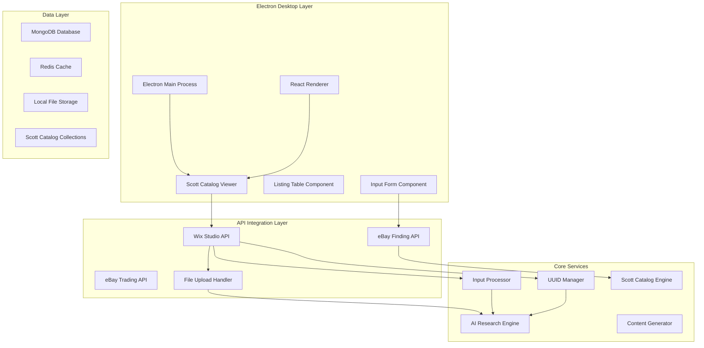

# Stamp Collection Platform - MVP Architecture

## 🎯 MVP Scope Definition

### Core MVP Features
1. **Simplified Input System**: 4-field stamp submission (Photos, Name, Auction, Price)
2. **UUID Management**: Global unique identifier system
3. **Database Operations**: Core CRUD operations with MongoDB and Redis
4. **Scott Catalog Integration**: Automatic Scott number lookup and valuation
5. **eBay API Integration**: Market research and listing capabilities
6. **Wix Studio API Integration**: Website and collection management
7. **AI Research Engine**: Basic stamp analysis and market research
8. **Content Generation**: AI-powered descriptions and metadata
9. **Electron Desktop Interface**: Native desktop application with offline capability
10. **EXE Installer**: Windows executable with auto-update functionality

### MVP Architecture Overview



## 🛠️ Technology Stack

### Desktop Application
- **Framework**: Electron with Node.js
- **Frontend**: React.js with TypeScript
- **UI Library**: Material-UI (MUI)
- **State Management**: Zustand + React Query
- **File Upload**: Electron native file dialogs
- **Installer**: Electron Builder for Windows EXE

### Backend Services
- **Database**: MongoDB with validation schemas
- **Cache**: Redis for session and data caching
- **AI/ML**: OpenAI API, Computer Vision services
- **File Storage**: Local file system with organized structure
- **Authentication**: JWT tokens with secure storage

### API Integrations
- **eBay**: Trading API and Finding API
- **Wix**: Studio API for website management
- **Scott Catalog**: Integrated MongoDB collections

### Infrastructure
- **Development**: Local MongoDB and Redis instances
- **Production**: Embedded database with sync capability
- **Packaging**: Electron Builder with auto-updater
- **Security**: Encrypted credential storage

## 📊 MVP Database Schema

### Core MongoDB Collections for MVP

```javascript
// Users collection (simplified for MVP)
db.createCollection("users", {
  validator: {
    $jsonSchema: {
      bsonType: "object",
      required: ["user_uuid", "username", "email"],
      properties: {
        _id: { bsonType: "objectId" },
        user_uuid: { bsonType: "string" },
        username: { bsonType: "string" },
        email: { bsonType: "string" },
        password_hash: { bsonType: "string" },
        created_at: { bsonType: "date" },
        is_active: { bsonType: "bool" },
        api_credentials: {
          bsonType: "object",
          properties: {
            ebay_token: { bsonType: "string" },
            wix_api_key: { bsonType: "string" }
          }
        }
      }
    }
  }
});

-- Stamps table (MVP version)
CREATE TABLE stamps (
    stamp_uuid UUID PRIMARY KEY DEFAULT gen_random_uuid(),
    user_id UUID REFERENCES users(user_id),
    
    -- User Input (4 fields)
    name VARCHAR(255) NOT NULL,
    user_price DECIMAL(10,2) NOT NULL,
    auction_enabled BOOLEAN DEFAULT FALSE,
    
    -- AI Generated Fields
    ai_description TEXT,
    ai_category VARCHAR(100),
    ai_tags JSONB DEFAULT '[]',
    country VARCHAR(100),
    year_issued INTEGER,
    denomination VARCHAR(50),
    condition_assessment VARCHAR(50),
    condition_score DECIMAL(3,2),
    estimated_value DECIMAL(10,2),
    
    -- Processing Status
    processing_status VARCHAR(20) DEFAULT 'pending',
    ai_confidence DECIMAL(3,2),
    
    -- Timestamps
    created_at TIMESTAMP DEFAULT CURRENT_TIMESTAMP,
    updated_at TIMESTAMP DEFAULT CURRENT_TIMESTAMP
);

-- Images table
CREATE TABLE stamp_images (
    image_id UUID PRIMARY KEY DEFAULT gen_random_uuid(),
    stamp_uuid UUID REFERENCES stamps(stamp_uuid) ON DELETE CASCADE,
    file_path VARCHAR(500) NOT NULL,
    file_name VARCHAR(255) NOT NULL,
    file_size INTEGER,
    is_primary BOOLEAN DEFAULT FALSE,
    created_at TIMESTAMP DEFAULT CURRENT_TIMESTAMP
);

-- AI Research Results
CREATE TABLE ai_research (
    research_id UUID PRIMARY KEY DEFAULT gen_random_uuid(),
    stamp_uuid UUID REFERENCES stamps(stamp_uuid),
    research_type VARCHAR(50), -- 'market_data', 'historical_info', 'similar_items'
    research_data JSONB,
    confidence_score DECIMAL(3,2),
    created_at TIMESTAMP DEFAULT CURRENT_TIMESTAMP
);
```

## 🧠 MVP AI Services

### Simplified AI Pipeline
1. **Image Analysis**: Basic computer vision for condition and features
2. **Market Research**: Simple web scraping for price references
3. **Content Generation**: Template-based + AI enhancement
4. **Data Enrichment**: Category classification and metadata extraction

### AI Service Integration
- **Primary**: OpenAI GPT for content generation
- **Secondary**: Basic image analysis libraries
- **Tertiary**: Web scraping for market data

## 📱 MVP User Interface Components

### Core UI Components
1. **Stamp Input Form**: 4-field submission form
2. **Image Upload**: Drag-and-drop photo upload
3. **Processing Status**: Real-time processing feedback
4. **Stamp List**: Table view of all stamps
5. **Stamp Detail**: Individual stamp view with AI-generated content
6. **Dashboard**: Summary statistics and recent activity

### Responsive Design
- **Desktop**: Full-featured interface
- **Tablet**: Optimized layout
- **Mobile**: Touch-friendly, simplified navigation

## 🔄 MVP Workflow

### User Journey
1. **Upload**: User uploads photos and fills 4 basic fields
2. **Submit**: Form submission triggers AI processing
3. **Process**: AI analyzes images and generates content
4. **Review**: User reviews AI-generated content
5. **Save**: Final stamp record saved to database
6. **Display**: Stamp appears in listing table

### Processing Pipeline
1. **Validation**: Input validation and file checks
2. **UUID Generation**: Unique identifiers assigned
3. **AI Analysis**: Image and text analysis
4. **Content Generation**: Descriptions and metadata
5. **Database Storage**: All data saved to PostgreSQL
6. **Status Update**: User notified of completion

## 📋 MVP Features List

### Phase 1 Features (Core MVP)
- [ ] User registration and authentication
- [ ] 4-field stamp input form
- [ ] Image upload and storage
- [ ] Basic AI content generation
- [ ] Simple stamp listing table
- [ ] Individual stamp detail view
- [ ] Mobile-responsive design

### Phase 2 Features (Enhanced MVP)
- [ ] Advanced AI image analysis
- [ ] Market research integration
- [ ] Batch stamp processing
- [ ] Export functionality
- [ ] Search and filtering
- [ ] User preferences

### Phase 3 Features (MVP+)
- [ ] Real-time processing status
- [ ] AI confidence indicators
- [ ] Content editing capabilities
- [ ] Basic analytics dashboard
- [ ] API endpoints for external access

## 🚀 MVP Success Metrics

### Technical Metrics
- **Response Time**: < 3 seconds for form submission
- **Processing Time**: < 30 seconds for AI analysis
- **Uptime**: > 95% availability
- **Error Rate**: < 5% processing failures

### User Experience Metrics
- **Completion Rate**: > 80% form completions
- **User Satisfaction**: > 4.0/5.0 rating
- **Mobile Usage**: > 30% mobile traffic
- **Return Usage**: > 60% user retention

### Business Metrics
- **Active Users**: 100+ registered users
- **Stamps Processed**: 1,000+ stamp records
- **AI Accuracy**: > 85% user acceptance of AI content
- **Performance**: Sub-minute stamp processing

## 📦 MVP Deliverables

### Backend Deliverables
1. **FastAPI Application**: Complete backend API
2. **Database Schema**: PostgreSQL with all MVP tables
3. **AI Services**: Basic AI processing pipeline
4. **Authentication**: JWT-based user system
5. **File Management**: Image upload and storage

### Frontend Deliverables
1. **React Application**: Complete web interface
2. **Mobile-Responsive**: Works on all devices
3. **Component Library**: Reusable UI components
4. **State Management**: Efficient data handling
5. **Error Handling**: User-friendly error messages

### Infrastructure Deliverables
1. **Docker Setup**: Complete containerization
2. **Development Environment**: Local development stack
3. **Database Migrations**: Schema versioning
4. **Monitoring**: Basic logging and metrics
5. **Documentation**: Setup and usage guides

## 🎯 MVP Timeline

### Week 1-2: Foundation
- [ ] Database schema setup
- [ ] Basic FastAPI application
- [ ] Authentication system
- [ ] Core React components

### Week 3-4: Core Features
- [ ] Stamp input form
- [ ] Image upload functionality
- [ ] Basic AI integration
- [ ] UUID management system

### Week 5-6: AI Integration
- [ ] AI content generation
- [ ] Market research basics
- [ ] Processing pipeline
- [ ] Status tracking

### Week 7-8: UI/UX Polish
- [ ] Mobile responsiveness
- [ ] Listing tables
- [ ] Detail views
- [ ] Error handling

### Week 9-10: Testing & Deployment
- [ ] Integration testing
- [ ] User acceptance testing
- [ ] Performance optimization
- [ ] Production deployment

---

**MVP Focus**: Deliver core value with minimal complexity
**Target Users**: Early adopters and stamp collectors
**Success Definition**: Functional 4-field input system with AI enrichment
**Next Phase**: Platform integrations and advanced AI features
